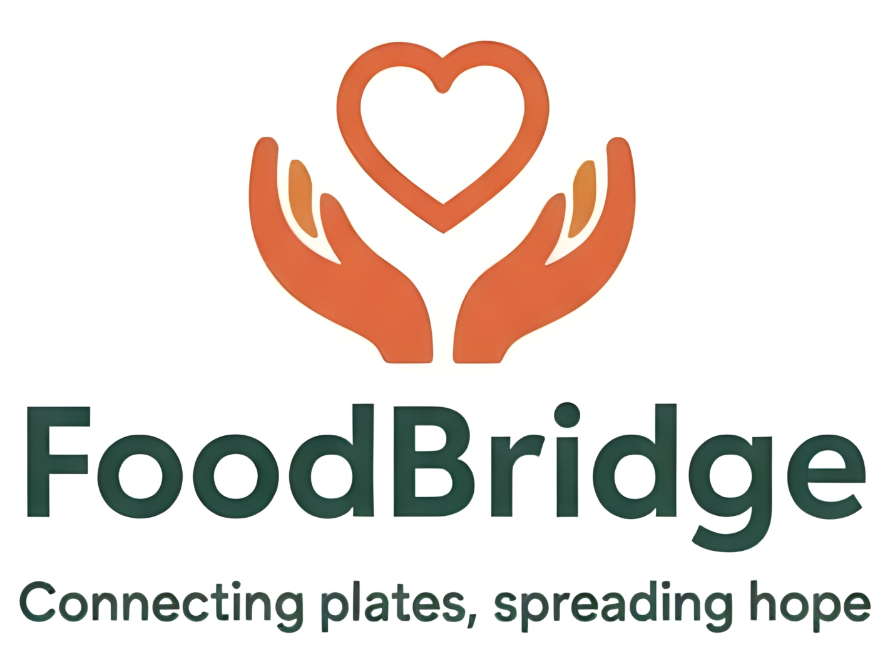

# 🍽️ FoodBridge - Connecting Plates, Spreading Hope



## 📖 About

**FoodBridge** is a food donation platform aimed at minimizing food wastage and feeding the needy across India. Our mission is to bridge the gap between surplus food from weddings, events, restaurants, and those who go hungry every day.

### The Problem We're Solving

- **40%** of food produced in India is wasted annually
- **194 million** Indians go hungry every day
- **15-20%** of food is wasted at wedding receptions alone
- Tons of food are discarded from events while millions starve

### Our Solution

FoodBridge connects donors (individuals, event organizers, restaurants, caterers) with verified NGOs to ensure surplus food reaches those who need it most, creating a zero-waste ecosystem.

## ✨ Features

- 🎯 **Easy Donation Process** - Simple form-based food donation system
- 🤝 **Volunteer Network** - Community-driven food collection and distribution
- 🏢 **NGO Partnerships** - Verified NGO network for efficient distribution
- 📊 **Impact Tracking** - See the real-time impact of your contributions
- 📱 **Mobile-Friendly** - Fully responsive design for all devices
- 🎊 **Event-Focused** - Special emphasis on weddings and large gatherings

## 🚀 Tech Stack

- **Framework**: [Next.js 16.0.1](https://nextjs.org/) (React 19.2.0)
- **Styling**: [Tailwind CSS v4](https://tailwindcss.com/)
- **Language**: JavaScript/JSX
- **Package Manager**: npm

## 🛠️ Installation & Setup

### Prerequisites

- Node.js (v18 or higher recommended)
- npm

### Getting Started

1. Clone the repository:
```bash
git clone <repository-url>
cd foodbridge
```

2. Install dependencies:
```bash
npm install
```

3. Run the development server:
```bash
npm run dev
# or
yarn dev
# or
pnpm dev
# or
bun dev
```

4. Open [http://localhost:3000](http://localhost:3000) with your browser to see the result.

You can start editing the page by modifying `src/app/page.js`. The page auto-updates as you edit the file.

This project uses [`next/font`](https://nextjs.org/docs/app/building-your-application/optimizing/fonts) to automatically optimize and load [Geist](https://vercel.com/font), a new font family for Vercel.

## 📦 Build & Deployment

### Development
```bash
npm run dev
```

### Production Build
```bash
npm run build
```

### Start Production Server
```bash
npm start
```

### Deploy on Vercel

The easiest way to deploy your Next.js app is to use the [Vercel Platform](https://vercel.com/new?utm_medium=default-template&filter=next.js&utm_source=create-next-app&utm_campaign=create-next-app-readme) from the creators of Next.js.

Check out the [Next.js deployment documentation](https://nextjs.org/docs/app/building-your-application/deploying) for more details.

## 🎨 Design

### Color Palette
- **Primary Orange**: `#DE673F` - Warmth and energy
- **Dark Green**: `#2E4938` - Growth and sustainability
- **White**: `#FFFFFF` - Purity and cleanliness

### Theme
The website features a clean, modern design with:
- Hero section with compelling call-to-actions
- Statistics showcasing impact
- Process flow explaining how it works
- Food wastage awareness section
- Testimonials from donors and NGOs
- FAQ section
- Contact information

## 📱 Website Sections

1. **Hero Section** - Eye-catching introduction with three CTA buttons
2. **What We Do** - Overview of FoodBridge's mission
3. **Food Wastage Crisis** - Awareness about India's food waste problem
4. **How It Works** - 4-step process explanation
5. **Banner** - Branding display
6. **Call to Action** - Encouraging participation
7. **Statistics** - Impact metrics (meals served, NGO partners, volunteers, cities)
8. **Testimonials** - User stories from donors, volunteers, and NGOs
9. **FAQ** - Common questions and answers
10. **Contact** - Team information and contact details
11. **Footer** - Branding and copyright

## 🔗 Integration Points

The website includes three main call-to-action buttons that link to Google Forms:

- **Donate Food** - For individuals/businesses wanting to donate
- **Volunteer** - For people wanting to help with collection/distribution
- **NGO Registration** - For NGOs wanting to partner

> **⚠️ Important**: Update the Google Form URLs in `src/app/page.js` with your actual form links. Replace:
> - `https://forms.google.com/donate-food`
> - `https://forms.google.com/volunteer`
> - `https://forms.google.com/ngo-registration`

## 👥 Team

- **Yash Kumar** - Co-Founder & Project Lead
  - Email: yashkm194@gmail.com

- **Mudassir Husain** - Co-Founder & Operations Head
  - Email: itsmudassir.official@gmail.com

## 📝 Configuration

### Next.js Config
The project uses Next.js with custom image configuration to allow external images from Unsplash.

See `next.config.mjs` for configuration details.

### Tailwind Config
Custom colors are defined in `tailwind.config.js`:
- `orange`: #DE673F
- `dark-green`: #2E4938

## 🌐 Environment

No environment variables required for basic setup. The application works out of the box.

## 📄 File Structure

```
foodbridge/
├── public/
│   └── images/
│       ├── banner.png      # Logo with name and tagline
│       └── logo.png        # Square logo
├── src/
│   └── app/
│       ├── globals.css     # Global styles and Tailwind imports
│       ├── layout.js       # Root layout with metadata
│       └── page.js         # Main landing page
├── next.config.mjs         # Next.js configuration
├── tailwind.config.js      # Tailwind CSS configuration
├── postcss.config.mjs      # PostCSS configuration
├── jsconfig.json           # JavaScript configuration
├── package.json            # Dependencies and scripts
└── README.md              # This file
```

## 🤝 Contributing

We welcome contributions to make FoodBridge better! Whether it's:
- Bug fixes
- New features
- Documentation improvements
- Design enhancements

Feel free to open issues and submit pull requests.

## 📊 Impact Goals

Our aim is to:
- Serve **100,000+** meals in the first year
- Partner with **100+** NGOs across India
- Build a volunteer network of **1000+** people
- Cover **50+** cities nationwide
- Reduce food wastage by creating awareness

## 📚 Learn More

To learn more about Next.js, take a look at the following resources:

- [Next.js Documentation](https://nextjs.org/docs) - learn about Next.js features and API.
- [Learn Next.js](https://nextjs.org/learn) - an interactive Next.js tutorial.

You can check out [the Next.js GitHub repository](https://github.com/vercel/next.js) - your feedback and contributions are welcome!

## 🙏 Acknowledgments

- Stock images from [Unsplash](https://unsplash.com/)
- Next.js team for the amazing framework
- Tailwind CSS for the utility-first CSS framework
- All volunteers and NGO partners who make this mission possible

## 📞 Contact

For inquiries, partnerships, or support:
- **Yash Kumar**: yashkm194@gmail.com
- **Mudassir Husain**: itsmudassir.official@gmail.com

## 📜 License

© 2025 FoodBridge. All rights reserved.

---

**Made with ❤️ to end hunger and reduce food waste in India**

*"Connecting plates, spreading hope"*

